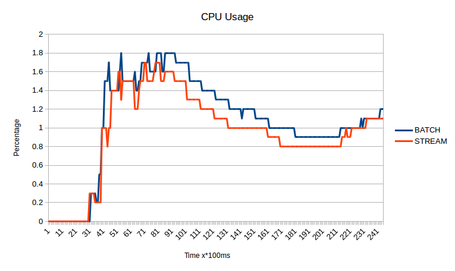
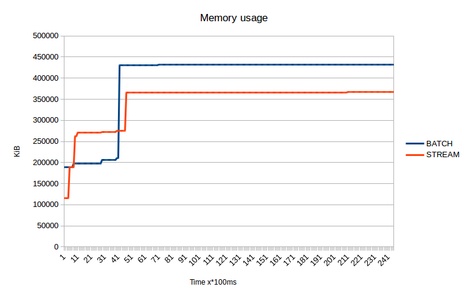
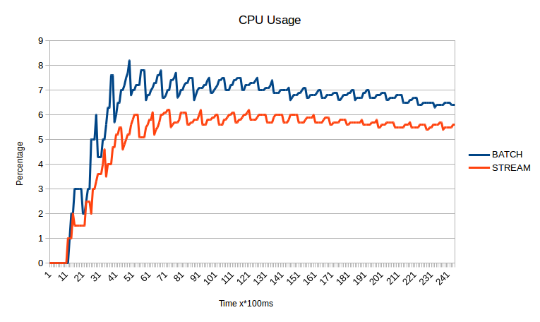
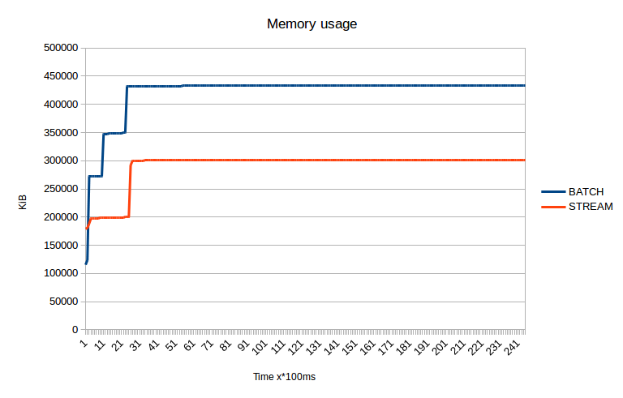

Over a month ago I've created a [handy tool](http://github.com/maciekmm/sitemap-generator/) to create sitemaps only with URLs matching specific rules. I want to talk about problems and challenges I faced, but mainly explain the art of **stream processing**.

Data scraping and more precisely web scraping involves parsing documents which access to is often quite slow.

More often than not the flow looks like this:

1. Make a request
2. Parse whole body into `html.Node` using `html.Parse()`
3. Iterate over parsed tree and process data

Code <s>stolen</s> borrowed from [golang docs](https://godoc.org/golang.org/x/net/html):

~~~go
doc, err := html.Parse(r)
if err != nil {
	// ...
}
var f func(*html.Node)
f = func(n *html.Node) {
	if n.Type == html.ElementNode && n.Data == "a" {
		// Do something with n...
	}
	for c := n.FirstChild; c != nil; c = c.NextSibling {
		f(c)
	}
}
f(doc)
~~~

And while very handy it comes with some disadvantages, namely:

- Bigger memory consumption
- Pointy CPU usage

To solve these issues we can process data while reading from the stream. By going this low level path we make it slightly more complicated, but surely more efficient.

Fortunately Golang comes with great tools to address this.

## Stream processing
So instead of waiting for not always blazing fast servers to send us whole file, we can start processing it in the middle of the process. Such paradigm is called stream processing.

Lets bring some really simple example, once again from my [sitemap-generator](https://github.com/maciekmm/sitemap-generator):

~~~go
doc := html.NewTokenizer(resp.Body)
for tokenType := doc.Next(); tokenType != html.ErrorToken; {
	token := doc.Token()
	if tokenType == html.StartTagToken {
		if token.DataAtom != atom.A {
			tokenType = doc.Next()
			continue
		}
		//Do something with it, for example extract url
		for _, attr := range token.Attr {
			if attr.Key == "href" {
				//url here attr.Val
				//ideally send it to some worker instance to avoid blocking here
			}
		}
	}
	tokenType = doc.Next()
}
resp.Body.Close()
~~~

As you can see, instead of going through elements one by one, we work on tokens. Calling `doc.Next()` makes it parse another token.

Tokens are more complicated to work with, you don't have direct access to innerhtml content so you have to implement some more logic to ensure Text token is a child of element you are looking for.

Going this way changes our flow to:

1. Read from the stream until specific element is present
2. Process that element
3. Repeat from point 1.

Lets see some graphs comparing both ways of scraping.

Small site

---

Medium site

---

These graph represents memory and cpu usage of time while creating a sitemap for small and medium sized sites using stream processing.

As you can see it scales well, especially regarding CPU utilization. You can also spot, that stream processing kicks in earlier than precompute everything (called batch here) processing.

## Parallelism

This section is not directly connected to stream processing, but some kind of parallelism should be used for data processing.

To speed up the process we can use parallel workers for downloading webpages and parallel workers for computing/processing data.

You have to ask yourself a question whether you need the latter one though, as the choke point will almost always be a blocking I/O - in this case downloading webpages. So unless your computing flow consists of blocking operation or highly cpu intensive code you are fine with single worker.

For sitemap-generator I've used:

- `n` downloader workers - `n` determined based on amount of proxies
	- picks up random HTTP client
	- parses documents and seeks for urls
	- sends links to validator worker using channels
- 1 validator/relay worker
	- makes sure no URLs are parsed twice
	- alters urls by cropping unneeded data such as `www` subdomain or unrelated querystring
	- makes sure URL belongs to processed site
	- sends URLs to downloader workers queue and file writing worker queue.
- 1 file writing worker
	- verifies whether given URL matches specific criterias to be written to file
	- paginates output
	- adds some additional data such as modification date

Validator worker does no cpu intensive job, therefore there's only one instance of it.

I'll not present any snippets or how to layout for this, as it's pretty complex topic on it's own and is a perfect candidate for another blog post.

## Should you use stream processing for webscraping?

It all depends, but most likely no. With webscraping relying on css paths/xPaths it might be a little tricky to get this to work, but when parsing really big files: lets say documents 100M+ it might be the right choice. Problem is such files are pretty uncommon if not rare.
Another use-case scenerio where stream processing would fit is realtime processing, such as scraping stock market prices.

I personally don't think stream processing brings enough performance improvement in the websites field to implement or replace libraries such as [goquery](https://github.com/PuerkitoBio/goquery). Especially with current hardware specifications.
Stream processing is definately the right choice for big data where terabytes are involved and realtime processing is required.
