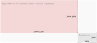

# Introduction

I was recently challenged with a pretty common, and frankly a simple problem of positioning a custom context menu. When you DuckDuckGo [*how to position a context menu*](https://duckduckgo.com/?q=positioning+a+context+menu&t=ffab&ia=web) phrase you will be greeted with solutions that either:
- [don't consider boundary conditions](https://stackoverflow.com/a/15795450) or
- [use javascript to check the conditions and position the menu accordingly](https://stackoverflow.com/a/31354591). 

The issue with the first solution is that it's not great in terms of **User Experience**.
The second one is okay but requires measurements and some javascript logic. It is also not responsive to window resizes.

# A different approach

After some time spent tinkering I came up with a CSS solution to **calculate the context menu position** which respects the window boundaries.

## TL;DR

## Demo 


#menu {
    --mouse-x: 0;
    --mouse-y: 0;
    display: none;
    position: fixed;
    margin: 0;
    left: 0;
    top: 0;
    /* The following line is responsible for all the magic */
    transform: translateX(min(var(--mouse-x), calc(100vw - 100%))) translateY(min(var(--mouse-y), calc(100vh - 100%)));
}


#menu {
    border-radius: 3px;
    width: 150px;
    border: 1px solid #eee;
    list-style: none;
    padding: 0;
    font-size: 10pt;
    color: #777;
    z-index: 5;
    background: #fff;
}

#menu li {
    width: 100%;
    height: 30px;
    line-height: 30px;
    padding-left: 20px;
    margin: 4px 0;
}

#menu li:hover {
    background: rgba(0, 0, 0, 0.05);
    cursor: pointer;
}


<ul id='menu'>
  <li>Option 1</li>
  <li>Option 2</li>
</ul>


const menu = document.querySelector('#menu');
// hide the menu
window.addEventListener('click', event => menu.style.display = 'none')
// show the menu when right-clicked
window.addEventListener('contextmenu', event => {
  event.preventDefault()
  menu.style.setProperty('--mouse-x', event.clientX + 'px')
  menu.style.setProperty('--mouse-y', event.clientY + 'px')
  menu.style.display = 'block'
});



# Explanation

Let's focus on the *transform* property:

```css
#menu {
  transform: translateX(min(var(--mouse-x), calc(100vw - 100%)))
             translateY(min(var(--mouse-y), calc(100vh - 100%)));
}
```

more specficially on the _translateX_ component, as it's analogous to _translateY_.

```css
transform: translateX(min(var(--mouse-x), calc(100vw - 100%)))
```

Let's break it down:

- `translateX` behaves *similarly* to `left` and moves an element along the X-axis.
  - `min` takes the smaller of two values
    - `var(--mouse-x)` dereferences a variable, in this case - the mouse position.
    - `calc` performs a calculation
      - `100vw` is the viewport's width, or simply put - the page width
      - `100%` **when used inside a translate, yields the current element width**

So, the `calc(100vw - 100%)` directive returns the page width decreased by the width of the context menu.

What we actually get is a value between `[0, viewport width - context menu width]` describing the `x` position of the context menu. This will not let the menu be positioned at the very edge of the screen.


